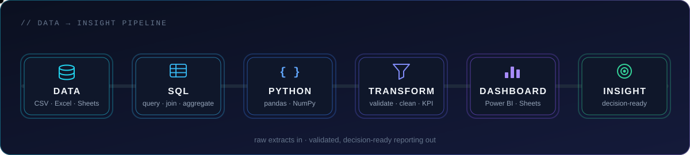

<!--
  Profile README for github.com/Anjub004
  Custom animations live in /assets (pure SVG + CSS/SMIL, no JavaScript).
  Contribution snake is generated daily by .github/workflows/snake.yml into the `output` branch.
  Previous README is kept at docs/README.backup.md
-->

 

## About me

I'm an **MIS & Data Analyst** who builds the systems behind the reports. I connect data from Excel, Google Sheets and SQL, validate and clean it, and turn it into dashboards and automated reports that teams can use to make decisions.

At work that mostly means **Google Sheets, Google Apps Script, SQL and Python**. Outside work I build open-source analytics tools and **machine learning projects** in NLP and computer vision. My background is in mathematics.

<table>
<tr>
<td width="50%" valign="top">

**Experience**

- **MIS Executive** · Cheers Hypermarket  Jul 2025 – Present · MIS reporting, workflow automation, daily performance dashboards
- **MIS Analyst** · Rath Infotech  Nov 2024 – Jun 2025 · operational dashboards, reporting automation with Google Sheets & SQL
- **Data Analyst** · ICICI Lombard  2023 – 2024 · customer-behaviour analysis for retention, Python & Excel

</td>
<td width="50%" valign="top">

**Focus areas**

- MIS reporting & reporting automation
- Data validation, cleaning & data quality
- Dashboards & business intelligence
- Process automation with Apps Script & Python
- Machine learning, NLP & computer vision

**Education:** Bachelor's in Mathematics, Mumbai University

</td>
</tr>
</table>

## Tech stack

**Data analytics** 

**Business intelligence & visualisation** 

**Automation** 

**Machine learning & AI** 

## How I work with data

  

## Featured projects

<table>
<tr>
<td width="50%" valign="top">

### [SmartMIS](https://github.com/Anjub004/smart-mis)
MIS automation & analytics platform · in active development

Upload Excel/CSV data, validate and clean it, calculate KPIs and SLA/TAT, flag potential anomalies and publish formatted MIS reports from one configurable pipeline. Data-quality scoring, quarantine for bad rows and a full change log.

`Python` `pandas` `SQLAlchemy` `Streamlit`

</td>
<td width="50%" valign="top">

### [Retail Analytics Toolkit](https://github.com/Anjub004/retail-analytics-toolkit)
SQL + Python retail analysis

Answers three retail questions: where stock is lost (shrinkage), whether visitors convert (footfall), and what will expire before it sells (short-expiry risk). Ships with a synthetic multi-branch dataset and auto-generated reports.

`SQL` `SQLite` `Python` `pandas`

</td>
</tr>
<tr>
<td width="50%" valign="top">

### [Power BI Data Analysis Collection](https://github.com/Anjub004/Power-BI-Data-Analysis-Collection-)
Interactive dashboards

Six Power BI dashboards: Budget vs Sales, Retail Sales, School Data, Heart Disease, Titanic Survival and Pokémon, each with KPIs, filters and drill-downs.

`Power BI` `KPI dashboards`

</td>
<td width="50%" valign="top">

### [Tableau Dashboard Collection](https://github.com/Anjub004/Tableau_Project)
Interactive dashboards

Tableau dashboards for Amazon shipping performance, Tesla stock price trends and UT Mart retail sales, built around KPIs, time-series trends and interactive filters.

`Tableau` `Excel`

</td>
</tr>
<tr>
<td width="50%" valign="top">

### [Smart Business Assistant](https://github.com/Anjub004/smart-business-assistance)
NLP chatbot with analytics

Streamlit chatbot that answers business FAQs and order queries using semantic intent detection, with a fallback for low-confidence inputs and a dashboard of intents and confidence.

`Streamlit` `sentence-transformers` `scikit-learn`

</td>
<td width="50%" valign="top">

### [NLP & Computer Vision Project](https://github.com/Anjub004/NLP-CV-Project-)
Deep learning

Tweet sentiment classification with SVM and Word2Vec, plus transfer learning for house image classification.

`NLP` `Word2Vec` `Transfer learning`

</td>
</tr>
<tr>
<td width="50%" valign="top">

### [Vehicle Classification (CNN)](https://github.com/Anjub004/Vehicle_Claasification_Using_CNN)
Computer vision

CNN classifier that distinguishes cars, trucks and other vehicles, with scripts for image preprocessing, training and evaluation.

`TensorFlow` `Keras` `CNN`

</td>
<td width="50%" valign="top">

### [Ghibli-Style Image Converter](https://github.com/Anjub004/Ghibli_Style_Image_Converted)
Generative AI

CycleGAN-based converter that turns photos into Ghibli-inspired artwork, served through a Gradio web interface and set up for Google Colab GPUs.

`CycleGAN` `Gradio` `Colab`

</td>
</tr>
</table>

<b>More projects</b>

 

- [Employee Wellness Prediction](https://github.com/Anjub004/Employee_Wellness_Prediction): end-to-end preprocessing and classification pipeline
- [Image Classification (CNN)](https://github.com/Anjub004/Image_Classification_Using_CNN): Building / Forest / Sea image classifier
- [OpenCV: Basic to Advanced](https://github.com/Anjub004/OpenCV_Basic2Advanced): image-processing notebooks
- [Linear Regression](https://github.com/Anjub004/Linear-Regression): house price prediction
- [Logistic Regression](https://github.com/Anjub004/Logistic-Regression): income (>50K) prediction
- [Python Projects](https://github.com/Anjub004/Python-Projects): notebooks and practice projects

## GitHub activity

<picture>
  <source media="(prefers-color-scheme: dark)" srcset="https://github-readme-stats.vercel.app/api?username=Anjub004&show_icons=true&hide_rank=true&hide_border=true&bg_color=0D1117&title_color=22D3EE&icon_color=A78BFA&text_color=CBD5E1" />
  
</picture>
<picture>
  <source media="(prefers-color-scheme: dark)" srcset="https://github-readme-stats.vercel.app/api/top-langs/?username=Anjub004&layout=compact&langs_count=6&hide=roff,batchfile&hide_border=true&bg_color=0D1117&title_color=22D3EE&text_color=CBD5E1" />
  
</picture>

<picture>
  <source media="(prefers-color-scheme: dark)" srcset="https://streak-stats.demolab.com/?user=Anjub004&hide_border=true&background=0D1117&stroke=1E293B&ring=22D3EE&fire=A78BFA&currStreakNum=F1F5F9&sideNums=F1F5F9&currStreakLabel=22D3EE&sideLabels=94A3B8&dates=64748B" />
  
</picture>

  

<picture>
  <source media="(prefers-color-scheme: dark)" srcset="https://raw.githubusercontent.com/Anjub004/Anjub004/output/github-snake-dark.svg" />
  
</picture>

## Currently learning

- **Data Science & Machine Learning**: ongoing course to deepen modelling skills
- **NLP and time-series modelling**: exploring both in personal projects
- **SmartMIS**: building a full MIS automation platform in public, phase by phase

## Let's connect

I'm interested in MIS, reporting automation, BI and applied ML. Feel free to reach out on [LinkedIn](https://www.linkedin.com/in/anju-barai-3b46b6282), read my writing on [Medium](https://medium.com/@anjubarai004), or email **anjubarai004@gmail.com**.

 

 

